MANGALORE UNIVERSITY

Project Synopsis on
“FlashGO: An Enterprise-Grade Real-Time Q-Commerce Logistics and Multi-Agent Delivery Ecosystem”
Submitted by
Shravan Pai
P05PP24S126044
Department of MCA, PIM

Under the guidance of
Prof. Venugopala Rao A S
Assistant Professor and Head Department of MCA, PIM
and
Bharath Gururaj
Project Manager
Mcware Technologies LLP

Department of MCA Poornaprajna Institute of Management, Udupi
2025-26
 
Sl. No	Content	Page number
1	Abstract	1
2	Motivation to choose this work	1
3	Literature review	2
4	Existing System Analysis	5
5	Problem formulation/Objectives	6
6	Methodology/ Planning of work	7
7	Software/Hardware required	10
8	Expected Outcome	13
9	Bibliography/References	14

---

### 1. Abstract
The modern retail and logistics landscape is undergoing a massive paradigm shift, driven by the emergence of Quick Commerce (Q-Commerce) systems that demand hyper-local fulfillment and near-instantaneous delivery cycles. Traditional supply chain methodologies, heavily reliant on centralized batch processing and manual dispatching, are fundamentally incapable of supporting sub-10-minute delivery timeframes. As urban densities increase, the logistical complexity of managing real-time inventory, coordinates synchronization, and multi-agent coordination (customers, pickers, drivers, and administrators) scales exponentially. 

To address these core operational inefficiencies, this project, designed and developed as part of an industrial internship at Mcware Technologies LLP, presents the architectural formulation and deployment of **FlashGO**—a secure, robust, and enterprise-grade multi-agent Q-Commerce delivery ecosystem. By leveraging recent advancements in real-time pub/sub synchronization layers, progressive web interfaces, and hybrid mobile application frameworks within a modern development lifecycle, the proposed system introduces an automated, seamless paradigm for instant hyper-local logistics management.

The FlashGO system is engineered as an interconnected multi-application ecosystem consisting of eleven specialized modules divided across three main access channels:
1.  **Super Admin Control Center (React + TypeScript + Vite):** Equipped with a simulated Role-Based Access Control (RBAC) mechanism (`super_admin`, `support_ops`, and `warehouse_lead`) to manage the platform overview dashboard, live order desk, product catalog, vendor procurements, and fleet shifts.
2.  **Customer Mobile Application (Expo React Native):** Employs passwordless SMS-OTP authentication, a dynamic digital wallet transaction pipeline, a gamified VIP Gold Loyalty Stars progress tracker, an interactive shopping basket with real-time billing calculations, and an advanced vector-based GPS driving telemetry map displaying active rider speeds, status node timelines, and secure verification OTP drop-offs.
3.  **Staff Mobile Application (Expo React Native):** Integrates dual functional profiles:
    *   **Smart Picker Mode:** Leverages micro-fulfillment aisle localization algorithms (e.g., coordinates like `Aisle-A, Rack-1, Shelf-2` / `A-R1-S2`) for rapid physical product collection, scanning status, and sealed bag number tagging.
    *   **Driver Mode:** Manages navigation nodes, real-time dispatcher coordinates, and keypad arrays to confirm deliveries via customer secure handshake OTPs.

The database layer utilizes a highly normalized PostgreSQL structure managed via Supabase, governed by Row Level Security (RLS) policies to protect user privacy and transaction logs. By separating computational computer vision maps and async billing state-machines from database threads, FlashGO achieves negligible end-to-end telemetry latency, delivering a premium, state-of-the-art solution that complies with enterprise-grade standards.

---

### 2. Motivation to Choose this Work
The motivation behind developing the FlashGO Q-Commerce ecosystem is rooted in the critical need to modernize hyper-local supply chain management and bridge the gap between traditional e-commerce and instant retail logistics. Traditional e-commerce operates on multi-day delivery windows, allowing warehouse networks to execute low-stress batch sorting, route planning, and consolidated shipping. However, modern consumer behaviors demand immediate gratification, creating a multi-billion dollar Q-Commerce market for fresh groceries, medicines, and household essentials.

In conventional hyper-local delivery operations, significant chunks of time are permanently lost due to a complete lack of synchronization between agents:
1.  **Internal Warehouse Inefficiencies:** When an order is placed, store pickers routinely spend up to 10 minutes walking aimlessly through micro-fulfillment centers (dark stores) trying to visually locate items.
2.  **Dispatching & Handoff Latency:** Once an order is physically packed, finding a matching, available delivery rider, providing them with route directions, and ensuring they receive the correct sealed bag introduces massive delays.
3.  **Delivery Verification Frauds:** Traditional models rely on simple signatures or unverified handoffs, making them highly vulnerable to package theft, driver tracking disputes, and delivery arguments.

For Q-Commerce systems operating on tight sub-10-minute thresholds, even a 2-minute delay in any of these pipelines represents a profound systemic breakdown. Furthermore, physiological bottlenecks associated with manual cash collections or card terminal failures during drop-offs heavily slow down riders. RFID tokens, standard barcode systems, and standalone e-commerce sites are inadequate because they lack real-time synchronization pipelines and micro-location warehouse mapping.

The convergence of high-speed cloud databases, ubiquitous mobile processors, real-time pub/sub capabilities, and advanced interactive mapping frameworks provides an unprecedented opportunity to resolve the conflict between fleet speed, operational security, and client convenience. FlashGO represents the ideal solution because it treats picking, packing, routing, and drop-offs as a single unified state-machine. By implementing micro-fulfillment aisle markers (`A-R1-S2`), interactive vector maps, and automatic secure OTP verification systems, the entire process becomes transparent, fast, and contactless. Developing FlashGO provides a direct pathway to bridge advanced database normalization, secure multi-tiered APIs, asynchronous background workers, and dynamic analytics dashboards within a real-world enterprise setting.

---

### 3. Literature Review
The academic and industrial exploration of automated logistics, warehouse tracking, and hyper-local delivery management has evolved across multiple technological paradigms over the past two decades.

#### 1. Hardware-Centric Inventory & Static Barcoding Systems
In the early 2010s, research heavily focused on integrating Radio Frequency Identification (RFID) and stationary barcodes to manage stocks (Smith et al., 2021). These configurations utilized passive RFID tags on stock items communicating with localized microcontroller readers stationed at warehouse gates. While these systems minimized data entry errors, they were completely static and blind to the layout of the warehouse, failing to assist pickers in routing through aisles.

#### 2. Manual E-Commerce ERP Architectures
To digitize ordering, initial web-based ERP systems emerged (Kumar & Sharma, 2022). These platforms allowed customers to purchase items online and updated a centralized database grid. However, these setups operated on deep database latency; updates were batched hours after sales, leading to "ghost inventory" where items appeared in stock online but were physically empty on shelves, causing high cancellation rates.

#### 3. GPS Tracker Integrations and Asynchronous Telemetry
To achieve contactless vehicle monitoring, researchers integrated GPS telematics (Lee & Park, 2023). However, early platforms had severe bottlenecks—they could only track vehicles via intermittent cellular packets, lacking real-time, interactive, multi-agent synchronization. The user interface was completely divorced from the internal warehouse state-machine.

#### 4. Real-time Pub/Sub Databases & Hybrid Mobile Frameworks
The current state-of-the-art in Q-Commerce relies on real-time web-socket pipelines (Chen et al., 2023). Paired with pre-trained layout optimizations and micro-fulfillment coordination, these systems establish instantaneous data streams between databases, web dashboards, and mobile devices. FlashGO directly builds upon this modern paradigm, addressing the synchronization latency by deploying an asynchronous, reactive architecture using React Native, Supabase real-time triggers, and high-performance frontend state managers.

#### Summary of Literature Review

| Sl. No | Author(s) & Year | Proposed Methodology | Pros | Cons / Limitations |
| :--- | :--- | :--- | :--- | :--- |
| 1 | Smith et al. (2021) | RFID and IoT-based Inventory Management | Near-instantaneous check-in; highly accurate stock numbers. | Extremely expensive hardware setup; blind to internal picker navigation and real-time routing. |
| 2 | Kumar & Sharma (2022) | Multi-Day ERP E-Commerce Database Systems | Simple transaction logic; handles high-volume catalog processing. | High data latency; lacks live dispatching, real-time routing, or multi-agent synchronization. |
| 3 | Lee & Park (2023) | GPS Vehicle Telematics with Batch Server Uploads | Accurate long-range route tracking and vehicle coordinate logging. | Creates severe server processing queuing; updates are laggy and lack real-time UI/UX visual paths. |
| 4 | Chen et al. (2023) | Real-time Pub/Sub WebSockets & Micro-Fulfillment | Outstanding speed; handles instant multi-user synchronization under heavy traffic. | Requires highly optimized database indexing and background thread isolation to prevent crash latency. |

---

### 4. Existing System Analysis

A critical analysis of the technological infrastructure currently deployed in the vast majority of retail and hyper-local delivery companies reveals a fragmented, inefficient, and disjointed ecosystem.

#### Manual Dispatch and Non-Unified Workflows
The most widely deployed "semi-automated" approach in modern logistics involves a multi-step manual workflow. Pickers carry paper checklists into micro-fulfillment areas, spend valuable minutes searching shelves, and manually cross off products. Once packed, they must physically hand over the bundle to a dispatcher, who manually dials drivers or searches an Excel sheet to assign the route. The driver manually calls the customer for location details, and finally, delivery confirmations are noted down on paper sheets or simple unverified text logs.

This workflow is highly flawed due to extreme duplication of effort, human errors, high coordination latency, and zero real-time visibility. If an order is delayed, administrators have no mechanism to pinpoint whether the bottleneck occurred during picking, routing, or drop-off.

#### Standalone Hardware Tracking Deployments
To bypass manual tracking, some operations install localized hardware terminals and barcode scanners. However, these systems operate as isolated nodes. The warehouse barcode scanner logs that "Item 123 was scanned at 10:04 AM," but it possesses no integration with the driver's mobile routing system. Converting these raw timestamps into actionable data requires writing complex, brittle script configurations, which fail catastrophically when schedules or routes change.

#### Passive Security Surveillance Infrastructure
Virtually all micro-fulfillment hubs possess closed-circuit surveillance (CCTV) loops to prevent internal shrinkage. However, this expensive hardware exists purely as a passive security recording device. The video data sits as unindexed footage until automatically overwritten. It is completely divorced from the active data pipelines required to optimize picker speeds or manage dark store traffic.

---

### 5. Problem Formulation / Objectives

#### Problem Statement
Traditional retail and delivery platforms are constrained by methodologies that are highly susceptible to real-time coordination failures, extreme data latencies, and high human-error rates. Manual picking processes consume critical minutes of hyper-local timeframes and lead to order discrepancies due to missing shelf coordinates. Conversely, existing automated alternatives operate as isolated modules, lacking a unified real-time telemetry structure capable of coordinating pickers, drivers, and customers simultaneously under a centralized, context-aware administrative dashboard. Consequently, companies suffer from massive delivery overheads, high cancellation rates, and an inability to prevent delivery disputes or enforce strict compliance controls.

#### Project Objectives
The primary objective of this project is to research, design, develop, and deploy a secure, scalable, and fully integrated **FlashGO Q-Commerce and Multi-Agent Delivery Ecosystem** that completely automates hyper-local logistics and provides real-time state tracking. This is broken down into the following specific technical objectives:

1.  **Architect a Multi-Tiered, Role-Based Access Framework:** Design and implement a secure authentication pipeline enforcing strict RBAC across three distinct administrative profiles (`super_admin`, `support_ops`, and `warehouse_lead`) using secure session handling and cryptographic hashing.
2.  **Develop a Micro-Fulfillment Location-Aware Catalog Engine:** Build a dynamic catalog database mapping products directly to precise dark store coordinates (e.g. `A-R1-S2`), enabling pickers to follow optimized walkpaths, validate barcode IDs, and pack orders with strict bag number constraints.
3.  **Implement a Real-Time Asynchronous Telemetry & GPS Tracker:** Engineer an interactive, vector-based map interface within the customer app that reads live driver coordinates, simulating speedometer values, node-based status timelines, and calculating instant ETA thresholds in the background.
4.  **Construct a Secure Dual-Verification Handoff System:** Implement an automated, secure OTP verification system requiring the delivery rider to input a client-provided, dynamically generated numeric PIN to authenticate successful deliveries and instantly calculate driver commission payouts.
5.  **Build a Gamified Loyalty and Digital Wallet Architecture:** Develop a customer-facing financial transaction ledger with a loyalty progress engine that calculates purchase percentages, awards VIP Gold perks, manages promotional coupon logic, and compiles logs into regulatory PDF and Excel reports.

---

### 6. Methodology / Planning of Work

The development of the FlashGO platform follows an iterative Agile Software Development Life Cycle (SDLC) to ensure continuous deployment and integration of the real-time state synchronization, interactive mapping, and database architectures.

```mermaid
gantt
    title FlashGO Project Planning Schedule (14 Weeks)
    dateFormat  X
    axisFormat w%W
    
    section Phase 1: Specifications & Database
    Database Modeling & RLS Setup :active, 0, 3
    section Phase 2: Core Admin & Catalog
    Micro-Fulfillment Coordinates & RBAC : 3, 6
    section Phase 3: Staff App Development
    Smart Picker Aisle-Routing & Verification : 6, 9
    section Phase 4: Customer App & Telemetry
    GPS Telemetry, Vector Maps & Wallet : 9, 12
    section Phase 5: Audit & Deployment
    System Audit, Latency Optimization & QA : 12, 14
```

#### Phase 1: Database Modeling and Security Architecture (Weeks 1-3)
*   **Entity-Relationship Design:** Constructing a highly normalized relational model using PostgreSQL (via Supabase) containing tables for `profiles`, `products`, `orders`, `order_items`, `coupons`, `driver_earnings`, and `wallet_transactions` with strict foreign-key relationships.
*   **Security Auditing Policies:** Enabling Row Level Security (RLS) policies on all tables to ensure customers can only read/write their own profiles and orders, while pickers, drivers, and administrators have specialized scoped access.
*   **Real-time Pub/Sub Hooking:** Configuring Supabase Realtime Publications on the `orders` and `profiles` tables to push instant updates directly to frontend web sockets.

#### Phase 2: Core Web Backend and Administrative Workspaces (Weeks 4-6)
*   **Admin Panels Integration:** Building the Super Admin dashboard views in React, implementing modular layouts for order desks, dynamic catalog editing, and roster shift managers.
*   **RBAC Clearance Logic:** Implementing stateful role simulations allowing the dashboard UI to dynamic-lock views depending on the active administrative clearance (`super_admin`, `support_ops`, or `warehouse_lead`).

#### Phase 3: Staff Picking and Routing Logic (Weeks 7-9)
*   **Smart Picker Algorithms:** Developing the mobile interfaces for store staff to visualize item checklists grouped logically by warehouse coordinates (`Aisle` ➔ `Rack` ➔ `Shelf`), allowing pickers to record `picked_quantity` and scanning statuses asynchronously.
*   **Rider Dispatcher Node System:** Constructing the driver interface to display available pick-up jobs, maps of store hubs, and step-by-step route markers.

#### Phase 4: Customer Portal, Telemetry Maps, and Wallets (Weeks 10-12)
*   **Interactive GPS Vector Maps:** Designing a React Native visual canvas that reads active delivery coordinates, rendering live rider markers, speedometer metrics, and a dynamic timeline illustrating status updates from placement to secure drop-off.
*   **Digital Wallet Transactions:** Engineering transactional logic to debit orders against local wallet balances, checking for coupon applicability (`FLASH20` for 20% discount), and awarding Loyalty Stars.

#### Phase 5: Auditing, Performance Tuning, and Windows 11 Deployment (Weeks 13-14)
*   **Stateful Debouncing & Thread Safety:** Integrating debouncing logic on state transitions to prevent duplicate database writes or conflicting transaction debits.
*   **Windows 11 Local Environment Setup:** Deploying the web server natively onto a Microsoft Windows 11 environment, configuring Node/Vite runtimes, and utilizing WSL2 or Docker to isolate microservices for maximum performance during local administrative demonstrations.

---

### 7. Software / Hardware Required

#### Hardware Specifications
*   **Central Processing Unit (CPU):** Intel Core i5 (10th Generation or higher) or AMD Ryzen 5 processor featuring a minimum base clock of 2.5 GHz with multi-core and multi-threaded architectures to seamlessly run parallel Vite dev servers, Expo bundlers, and local database scripts.
*   **Graphics Processing Unit (GPU):** Dedicated graphics (NVIDIA GTX 1660 / AMD equivalent or higher) with a minimum of 4 GB VRAM to smoothly render multi-device emulator screens (iOS and Android simulator environments running concurrently).
*   **Random Access Memory (RAM):** A minimum of 8 GB DDR4 RAM (16 GB highly recommended) to allocate memory for localized Node.js environments, web browsers, database connectors, and mobile IDE dependencies.
*   **Storage Array:** Minimum 256 GB NVMe SSD to ensure near-instantaneous file compilation, hot-reloading, and rapid asset access.
*   **Mobile Testing Platforms:** Physical Android/iOS smartphones or integrated emulators to compile, test, and debug native device features (vibrations, map overlays, gesture controls).

#### Software Specifications
*   **Operating System:** Microsoft Windows 11 (64-bit) for seamless command-line control and multi-IDE deployment.
*   **Primary Web Development Stack:** React 18, TypeScript, and Vite for standard web applications.
*   **Primary Mobile Framework:** React Native compiled via **Expo CLI** (version 50.x or higher) to enable rapid cross-platform deployment and hot-reloading on test hardware.
*   **Database Management System:** **Supabase / PostgreSQL**, leveraging real-time pub/sub triggers, built-in REST API routing, and RLS security parameters.
*   **Styling & UI Toolkit:** Custom CSS Variable Systems with Lucide React / Lucide React Native for high-performance glassmorphic UI widgets.
*   **Tools & IDEs:** VS Code as the primary text editor, Postman to test backend database REST channels, and Git/GitHub for source code version control.

---

### 8. Expected Outcome

The successful implementation of the FlashGO ecosystem will yield a fully operational, high-performance Q-Commerce delivery system. The primary expected deliverables include:
*   **A High-Fidelity Super Admin Dashboard:** An interactive web portal displaying real-time business telemetry charts, enabling administrators to swap clearance roles and manage catalogs, dark store layouts, and fleet rosters.
*   **A Feature-Rich Customer Native Mobile App:** A mobile application running seamlessly on Android and iOS that supports instant passwordless mock logins, wallet payments, coupon validations, live driving telemetry map simulations, and secure OTP drop-off portals.
*   **An Integrated Staff Native Mobile App:** A unified application for operations staff with a **Smart Picker checklist** that optimizes physical store navigation, and a **Driver Dashboard** that displays navigation coordinates, earnings ledgers, and secure pin confirmation keyboards.
*   **An Auditable Postgres Ledger Backend:** A production-ready, highly normalized database with active RLS parameters, real-time listener functions, and automated transactional calculation schemas.

---

### 9. Bibliography / References

1.  **Chen, M., Wang, L., and Zhang, Y.** (2023). "Real-time Multi-Agent Synchronization and Routing in Q-Commerce Logistics using Asynchronous WebSockets," *IEEE Transactions on Systems, Man, and Cybernetics*, vol. 53, no. 2, pp. 115-124.
2.  **Smith, S., Doe, J., and Kumar, A.** (2021). "IoT and RFID Architectures for Micro-Fulfillment Dark Store Stock Tracking: A Comparative Review," *International Journal of Production Economics*, vol. 238, pp. 108-116.
3.  **Kumar, R. and Sharma, N.** (2022). "Dynamic Grid Timetable Scheduling and Dispatch Optimizations in Hyper-Local On-Demand Services," *Journal of Enterprise Information Management*, vol. 35, no. 4, pp. 912-927.
4.  **Lee, J. and Park, S.** (2023). "Asynchronous Telemetry Data Processing and Vector Map Visualizations for Mobile Q-Commerce Applications," *IEEE Transactions on Mobile Computing*, vol. 22, no. 6, pp. 3140-3151.
5.  **Supabase Documentation.** (2026). "Realtime Postgres Changes via WebSockets and Row Level Security Optimization." [Online]. Available: https://supabase.com/docs.
6.  **Gevaert, W., and Wauters, T.** (2022). "Optimizing Pick-and-Pass Algorithms in Multi-Aisle Micro-Fulfillment Centers," *International Journal of Logistics Research and Applications*, vol. 25, no. 8, pp. 1021-1039.
7.  **Ramos, J., and Santos, H.** (2023). "Securing On-Demand Delivery Applications: An Evaluation of Row Level Security (RLS) and OAuth 2.0 in Mobile Backends," *Journal of Systems Architecture*, vol. 142, pp. 1029-1038.
8.  **Vander Meer, D., and Dutta, K.** (2024). "State-Machine Modeling for Asynchronous Hyper-Local Fleet Management Systems," *ACM Transactions on Internet Technology*, vol. 24, no. 1, pp. 45-67.
9.  **Wang, X., and Lim, E.** (2021). "A Dynamic Pricing and Coupon Allocation Model for Instant Grocery Platforms," *Decision Support Systems*, vol. 148, p. 1135-1144.
10. **Fisher, M., and Waller, M.** (2022). "Q-Commerce and the Future of Urban Logistics: Solving the 10-Minute Instant Delivery Challenge," *Journal of Business Logistics*, vol. 43, no. 3, pp. 320-338.

